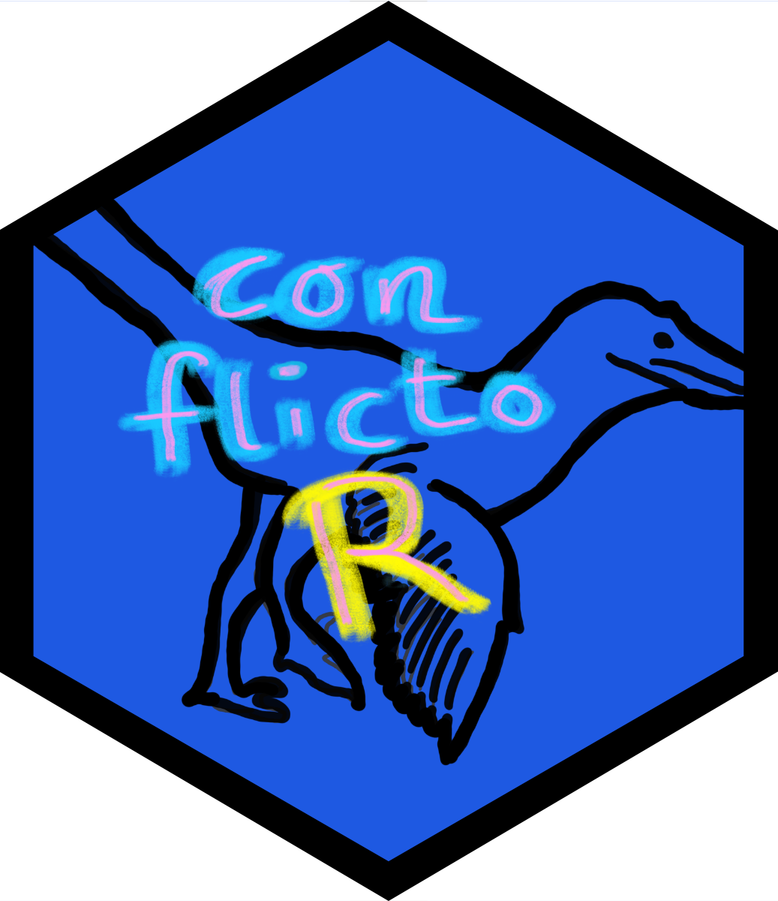

<!-- README.md is generated from README.Rmd. Please edit that file -->

```{r, include = FALSE}
knitr::opts_chunk$set(
  collapse = TRUE,
  comment = "#>",
  fig.path = "man/figures/README-",
  out.width = "100%"
)
```

# conflictoR 

<!-- badges: start -->
[](https://cran.r-project.org/package=conflictoR)
[](https://lifecycle.r-lib.org/articles/stages.html#experimental)
[](https://cran.r-project.org/web/licenses/MIT)

[](https://github.com/datapumpernickel/conflictoR/actions/workflows/R-CMD-check.yaml)
<!-- badges: end -->

The goal of conflictoR is to provide a user-friendly R interface for accessing and analyzing conflict data from the Uppsala Conflict Data Program (UCDP) API. With conflictoR, you can dynamically fetch, filter, and analyze conflict datasets directly from the source, streamlining research and data analysis workflows related to global conflicts.

## Installation

You can install the development version of conflictoR from [GitHub](https://github.com/) with:

``` r
# install.packages("devtools")
devtools::install_github("datapumpernickel/conflictoR")
```

## Example

This is a basic example which shows you how to solve a common problem:

```{r example, eval = F}
library(conflictoR)

# Fetch UCDP GED events with specific filters
response_ged <- cl_get_data(
  resource = "gedevents",
  version = "24.1",
  country = c(90, 91, 92), # Guatemala, Honduras, El Salvador
  start_date = "2000-01-01",
  end_date = "2007-10-12",
  type_of_violence = c(1, 3)
)

# Print the response
print(response_ged)

```


